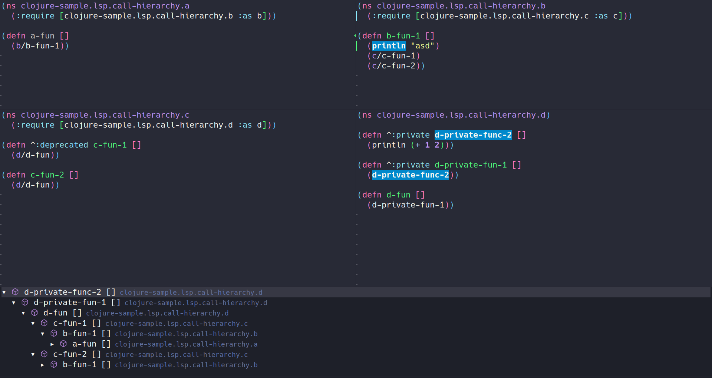

# Features

Above you can find all available features that clojure-lsp provide with examples using [Emacs lsp-mode](https://emacs-lsp.github.io/lsp-mode/) client.

### Find a function/var definition

### Find all references of a function, var, keyword or namespace alias

### Show all workspace/project symbols

### Show all symbols on current file

### Rename symbols

### Document highlight on hover showing symbol usages

### Completion

#### Snippets

[Snippets](https://microsoft.github.io/language-server-protocol/specifications/specification-current/#snippet_syntax) are templates that make it easier to enter repeating code patterns, such as common functions/forms, they are available during completion. Tabstops are defined as `$number` with `$0` as last tabstop.

<strong>Check all available snippets here</strong>

<table>
<thead>
    <tr>
        <th>name</th>
        <th>description</th>
        <th>raw content</th>
    </tr>
</thead>
<tbody>
    <tr>
        <td><code>comment$</code></td>
        <td>Create comment block</td>
        <td><code>(comment\n  $0\n  )</code></td>
    </tr>
    <tr>
        <td><code>condp$</code></td>
        <td>Create condp</td>
        <td><code>(condp ${1:pred} ${2:expr}\n $0)</code></td>
    </tr>
    <tr>
        <td><code>def$</code></td>
        <td>Create def</td>
        <td><code>(def ${1:name} $0)</code></td>
    </tr>
    <tr>
        <td><code>defmethod$</code></td>
        <td>Create defmethod</td>
        <td><code>(defmethod ${1:name} ${2:match}\n [${3:args}]\n $0)</code></td>
    </tr>
    <tr>
        <td><code>defmulti$</code></td>
        <td>Create defmulti</td>
        <td><code>(defmulti ${1:name} ${2:dispatch-fn})</code></td>
    </tr>
    <tr>
        <td><code>defn-$</code></td>
        <td>Create private function</td>
        <td><code>(defn%s ${1:name} [$2]\n  $0)</code></td>
    </tr>
    <tr>
        <td><code>defn$</code></td>
        <td>Create public function</td>
        <td><code>(defn ${1:foo} [$2]\n  $0)</code></td>
    </tr>
    <tr>
        <td><code>defprotocol$</code></td>
        <td>Create defprotocol</td>
        <td><code>(defprotocol ${1:Name}\n $0)</code></td>
    </tr>
    <tr>
        <td><code>defrecord$</code></td>
        <td>Create defrecord</td>
        <td><code>(defrecord ${1:Name} [${2:fields}]\n ${3:Protocol}\n $0)</code></td>
    </tr>
    <tr>
        <td><code>deftype$</code></td>
        <td>Create deftype</td>
        <td><code>(deftype ${1:Name} [${2:fields}]\n ${3:Protocol}\n $0)</code></td>
    </tr>
    <tr>
        <td><code>fn$</code></td>
        <td>Create fn</td>
        <td><code>(fn [${1:arg-list}] $0)</code></td>
    </tr>
    <tr>
        <td><code>if$</code></td>
        <td>Create if</td>
        <td><code>(if ${1:test-expr}\n ${2:then-expr}\n ${3:else-expr})</code></td>
    </tr>
    <tr>
        <td><code>import$</code></td>
        <td>Create import</td>
        <td><code>(:import [${1:package}])</code></td>
    </tr>
    <tr>
        <td><code>kwargs$</code></td>
        <td>Create keyword args</td>
        <td><code>{:keys [${1:keys}] :or {${2:defaults}}}</code></td>
    </tr>
    <tr>
        <td><code>let$</code></td>
        <td>Create let</td>
        <td><code>(let [$0])</code></td>
    </tr>
    <tr>
        <td><code>letfn$</code></td>
        <td>Create letfn</td>
        <td><code>(letfn [(${1:name} [${2:args}]\n $0)])</code></td>
    </tr>
    <tr>
        <td><code>ns$</code></td>
        <td>Create ns</td>
        <td><code>(ns $1\n  $0)</code></td>
    </tr>
    <tr>
        <td><code>require$</code></td>
        <td>Create require</td>
        <td><code>(:require [${1:namespace} :as [$0]])</code></td>
    </tr>
    <tr>
        <td><code>use$</code></td>
        <td>Create use</td>
        <td><code>(:use [${1:namespace} :only [$0]])</code></td>
    </tr>
</tbody>
</table>

##### Custom snippets

User can register additional custom snippets, for more information on how to configure it, check the [snippets settings section](https://clojure-lsp.io/settings/#snippets).

### Code actions

| Name                               | Example                                                              |
|------------------------------------|----------------------------------------------------------------------|
| Clean namespace require/imports    |                 |
| Add missing require                |      |
| Add known common require           |       |
| Add known common import            |        |
| Add suggested alias require        |     |
| Inline symbol                      |            |
| Extract function                   |         |
| Move to let                        |              |
| Change coll to map,vector,set,list |              |
| Thread first/all last              |         |
| Create private function            |  |
| Resolve macro as...                |         |

### Code lenses showing symbol references

### Format a whole file or range

### Signature help

### Semantic tokens

Experimental: apply color on client editor for each known token

### Call hierarchy

Show the incoming or outgoing call hierarchy of a function/variable as a lazy tree

##### Incoming

Show functions that call the current one recursively

##### Outgoing

Show functions that the current one call, recursively

### Execute command

Commands that client can request. Some code actions use these commands as actions.

#### Refactoring

Commands that change/refactor the code, most of them are available via code actions.

##### Clean namespace *
##### Add import to namespace
##### Add missing namespace *
##### Cycle privacy of def/defn
##### Cycle collection (#{}, {}, [], ())
##### Change collection to {}, (), #{}, []
##### Extract Function *
##### Create private function *
##### Inline Symbol *
##### Expand let
##### Introduce let
##### Move expression to let
##### Thread first expression
##### Thread last expression
##### Thread first all *
##### Thread last all *
##### Unwind all
##### Unwind thread
##### Create test

#### Resolve macro as *

This code action should be wrapped by the LSP client to provide the missing arguments beside the existing return by the code action: 

- The macro which should resolve as e.g. `clojure.core/def`
- The clj-kondo configuration to save the new setting. e.g `/home/user/.clj-kondo/config.edn`

For an example, check how [Emacs LSP client](https://github.com/emacs-lsp/lsp-mode/commit/73b127f4cf09a443e1353aa6c40b2379b59c1bd6) handles that.

_* Available via code actions too_

#### Dev

##### Server information

Return basic information about the server.

##### Cursor information

Return debug information about the element at point.

### Custom message to client during any server process

During some process, `clojure-lsp` send messages to client informing some proccess, warning or error.

## Diagnostics (linter)

All linters besides the ones below come from [clj-kondo](https://github.com/clj-kondo/clj-kondo) that clojure-lsp calls under the hood to lint the code and retrieve the analysis to
make most of features work.

Every linter configuration should be done on clj-kondo side, so anything related to unresolved symbols or unknown macros are probably related to wrong clj-kondo for the project. For more information on how to configure clj-kondo check [here](https://github.com/clj-kondo/clj-kondo/blob/master/doc/config.md#unrecognized-macros).

Below you can find the custom linters implemented on clojure-lsp side that uses the `:custom-lint-fn` from clj-kondo:

### clojure-lsp/unused-public-var

For more information on how to configure it, check the [diagnostics settings section](https://clojure-lsp.io/settings/#diagnostics-linter).
